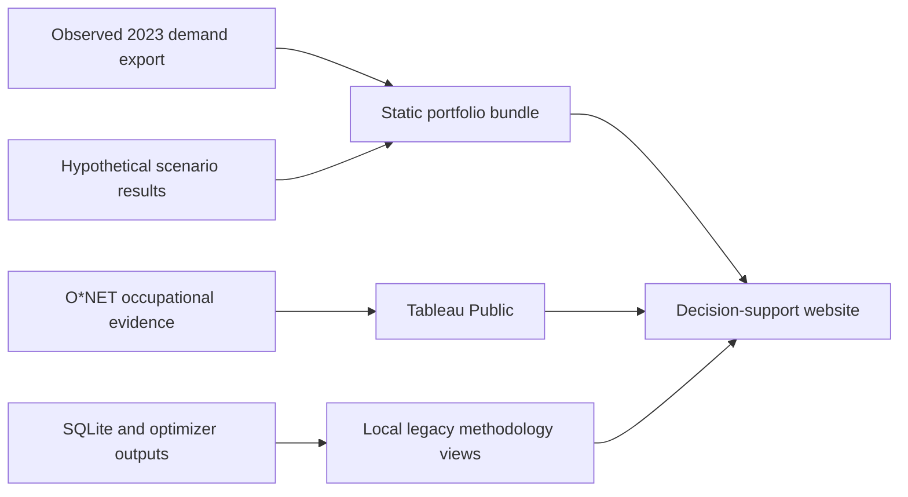

# Workforce Capacity Planner

This folder is the working source of truth for the Workforce Capacity Planner for Distributed Operations project.

## Published Tableau dashboards

The portfolio visualization is published on Tableau Public:

- [Warehouse Workforce Capacity Planner](https://public.tableau.com/views/WarehouseWorkforceCapacityPlanner/DemandInsights?:showVizHome=no)

It presents observed 2023 warehouse order demand, explicitly hypothetical
staffing cost and service scenarios, later-period validation, and O*NET 31.0
occupational evidence. The Tableau analysis is separate from the older local
network-planning prototype described below; scenario inputs are not observed
company staffing records.

## Local dashboard

Run `python3 scripts/serve_dashboard.py` and open http://127.0.0.1:8765.
Use `--port 8766` if the default port is occupied. No additional runtime packages
are required. The default product experience uses the observed 2023 demand
export and precomputed staffing cases. It provides a demand overview, interactive
scenario comparison, validated recommendations, methodology, and embedded
Tableau reporting. The older 2011 network model is retained in the codebase for
reproducibility but is intentionally excluded from the portfolio navigation. The
app does not run new optimizations.
The server binds to localhost and only serves the dashboard assets and data API.
The browser smoke check is `node scripts/check_dashboard.cjs` with Playwright
available and the server running on port 8765.

### 2023 network capacity replay

Run `python3 scripts/build_2023_network_capacity.py` to rebuild the portfolio's
site-level capacity view. It applies all retained 2023 observed orders and units
to the three modeled sites using the documented QCEW employment-share proxy. A
fixed staffing plan is sized from the 95th percentile of recorded daily demand,
then replayed under low, base, and high productivity sensitivities.

The replay excludes dates without source records. Site demand, staffing,
productivity, wages, and resulting capacity gaps are modeled assumptions, not
observed facility operations or recommended headcount. Results are written to
`data/processed/network_capacity_2023.json` and copied into the static portfolio
bundle by `scripts/build_static_dashboard.py`.

### Public portfolio build

The modern demand, comparison, recommendation, methodology, and Tableau views
also work as a static site. Build the API-free data bundle with:

```bash
python3 scripts/build_static_dashboard.py
python3 -m http.server 8766 --directory dashboard
```

Then open http://127.0.0.1:8766. The static build intentionally hides the local
SQLite data register and legacy network model. The GitHub Pages workflow in
`.github/workflows/pages.yml` rebuilds the bundle and publishes `dashboard/`
after a push to `main`. Directly opening `dashboard/index.html` with a `file://`
URL is unsupported because browsers block local data requests.

### Product architecture



The public experience keeps observed demand, modeled scenarios, and external
occupational evidence visibly separate. It does not expose the local database,
run new optimization, or prescribe staffing levels.

### Revised packing scenarios

Run `.venv/bin/python scripts/run_packing_optimization.py` to solve the three
12/24/48-unit packing-job sensitivities. This writes a separate
`data/processed/packing_optimization_results.json`; the legacy baseline remains
available. The dashboard workload-model selector uses these outputs after a
reload. The browser smoke test expects these three outputs and Google Chrome.
These are uncalibrated assumptions, not measured packing rates or carton sizes.
Picking remains at the base productivity case. Paid-time availability is applied
once on the capacity side. See `PACKING_INTEGRATION_RESULTS.md` for limitations.

Start with:

- `PROJECT_BRIEF.md` for the product definition and agreed scope.
- `ROADMAP.md` for the build sequence.
- `DECISIONS.md` for choices made during collaboration.

When the project changes, update the relevant file before starting a new implementation phase. Keep assumptions and open questions separate from verified results.

## Local data and credentials

- `data/reference/onet_db_31_0_excel.zip` is the downloaded O*NET Database release 31.0. It provides local occupation, task, skill, and work-context data, so an O*NET API key is not required for the first build.
- Copy `.env.example` to `.env` and set `CENSUS_API_KEY` locally. Do not commit `.env` or paste its key into chat.
- Raw downloaded and generated data belongs in `data/raw/` and is ignored by Git. Keep source URLs, release dates, and transformations documented in the data dictionary.

## Build the data foundation

```bash
python3 scripts/build_database.py
```

This creates `data/workforce_planner.db` from the saved inputs and runs the
required data-quality checks. See `DATA_SCHEMA.md` for table lineage, row
counts, and limitations.

Run the Phase 2B planning engine after building the database:

```bash
python3 scripts/run_planning_engine.py
```

The engine writes three fixed-staffing productivity cases to the database.
Query `planning_run_summary` for the headline results and
`planning_quality_results` for the engine checks. See `PHASE_2B_RESULTS.md` for
the current interpretation and limitations.

For the preliminary Phase 3 staffing comparison, run
`python3 scripts/compare_staffing_options.py` after the planning engine.
It saves `data/processed/staffing_option_comparison.json`; assumptions, research,
results and remaining optimization work are in `STAFFING_OPTIONS_RESEARCH.md`.

Phase 3B adds synthetic rosters and constrained overtime/temporary-shift optimization:

```bash
python3 -m venv .venv
.venv/bin/python -m pip install -r requirements.txt
.venv/bin/python scripts/run_optimization.py
PYTHONPATH=src .venv/bin/python -m unittest discover -s tests -v
```

Build the database and run the planning engine first. Edit scenario policies in
`config/optimization.json`. Auditable actions and solver statuses are saved in
`data/processed/optimization_results.json`; see `PHASE_3B_RESULTS.md` for the
research, synthetic-data boundaries, results and remaining work.

Phase 3C adds cross-training, paid fixed-term hiring and transfers:

```bash
.venv/bin/python scripts/run_network_optimization.py
```

The new action controls are in `config/workforce_actions.json`. Results and
worker-level actions are saved in `data/processed/network_optimization_results.json`.
See `PHASE_3C_RESULTS.md` for research, assumptions, interpretation and validation.
The script includes a slower-travel sensitivity and preserves FEASIBLE versus
OPTIMAL solver labels.

Refresh the Census QWI extract before rebuilding when needed:

```bash
/Users/minhtrivi/.cache/codex-runtimes/codex-primary-runtime/dependencies/python/bin/python3 scripts/fetch_census_qwi.py
python3 scripts/build_database.py
```

An isolated footwear demand/absence/backlog experiment is available with
`python3 scripts/build_footwear_scenario.py`. See
[FOOTWEAR_BACKLOG_SCENARIO.md](FOOTWEAR_BACKLOG_SCENARIO.md) for source attribution,
assumptions and results. It does not modify the existing dashboard or optimizer.

The five evidence-first operational analyses are documented in
[OPERATIONAL_ACTIONS.md](OPERATIONAL_ACTIONS.md): order segmentation, peak-response
comparisons, location-review priorities, experimental packing reference and
duplicate-data sensitivity. Reproduce with `scripts/analyze_operational_actions.py`.

Explicit hypothetical staffing and operating-day service scenarios are defined in
`config/footwear_scenarios.json`. Run `python3 scripts/run_service_scenarios.py`;
see [SERVICE_SCENARIOS.md](SERVICE_SCENARIOS.md) for definitions and results.

Compare hypothetical permanent capacity, overtime and delayed temporary shifts
with `python3 scripts/compare_service_costs.py`. See
[SERVICE_COST_COMPARISON.md](SERVICE_COST_COMPARISON.md) for costs, stress results
and limitations; rates and policy limits are in `config/staffing_cost_scenarios.json`.

Final price and chronological checks are in [RECOMMENDATION.md](RECOMMENDATION.md).
Run `python3 scripts/validate_recommendations.py`. The preferred policies remained
stable across tested prices but the two frozen choices did not meet their targets
in every later-period case. Run `python3 scripts/build_decision_answer.py` after
validation to regenerate the site-by-site answer and post-hoc replacement-policy
comparison shown in [DECISION_ANSWER.md](DECISION_ANSWER.md).
