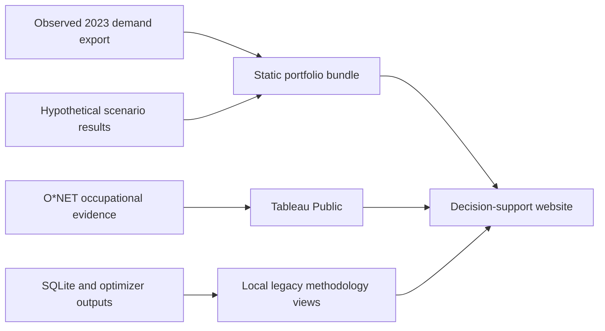

# Workforce Capacity Planner

**Do three warehouse sites have enough workers for the expected workload, and if not, what is the cheapest safe fix?**

This repo is a three part series on fulfillment operations:

1. **Forecast demand.** How much work is coming? (`scripts/forecast_demand.py`, see Technical details)
2. **Plan capacity.** Do the sites have enough workers? (this page)
3. **Protect parcels on the middle mile.** When trucks run late, which parcels are at risk and what is the cheapest fix? ([middle_mile/](middle_mile/README.md)) With the 6 worker plan, trucks cause 446 late parcels (37 from real 2023 snow and heavy rain, 365 on one tight Chicago to Indianapolis schedule); with 10 workers, 138, because understaffing leaves no time to absorb a late truck.
4. **Stock the shelves and reach the door.** How much inventory should each site hold, and should stations run vans or use a parcel carrier? ([inventory/](inventory/), [last_mile/](last_mile/), see Part 4 below)

## The answer

Each modeled site covers at least 95% of its workload on most days, but none removes every shortfall hour across the recorded 2023 workload. The analysis found two staffing options:

| Option | Workers | Overtime | Stress cases passed | Modeled cost |
| --- | ---: | --- | ---: | ---: |
| Affordable base case | 6 | Up to 2 hours | 12 of 36 | $106,326 |
| Lowest risk | 10 | Up to 2 hours | 36 of 36 | $176,616 at most |

Choose the 6 worker plan when productivity is near 40 units per productive hour and attendance is stable. Choose the 10 worker plan when low productivity or two worker absence is possible. See [DECISION_ANSWER.md](DECISION_ANSWER.md) for the site by site answer.

**At real labor costs.** These costs use the model's assumed $22 an hour. Real 2023 data from BLS puts a warehouse worker at about $33 an hour to the employer (pay plus benefits and payroll taxes), so both plans cost roughly half as much again, and the gap between them grows. Replayed on 25 four week windows of real 2023 demand, 6 workers with overtime and temps on call beat 10 workers by $41,239 every 4 weeks at real costs, against $27,200 at assumed costs, with the same on time service. See [Checked against real data](#checked-against-real-data).

## What this means for the business

In plain English. Dollar amounts use the model's assumed wages, so they are planning estimates, not money already saved.

| Takeaway | The number | What to do |
| --- | --- | --- |
| Temps on call beat permanent hiring | About **$27,200 saved every 4 weeks** (39% cheaper, roughly $350,000 a year); at real 2023 labor costs from BLS, about **$41,200**. On real 2023 demand the lean plan still shipped 99.7% of orders on time, against 100% for 4 extra permanent workers. | Keep 6 workers, with overtime and temps on call for busy days. |
| A better forecast is not worth buying | A perfect forecast would save only about **$260 every 4 weeks**. Daily orders swing too much to predict well (the best model still misses a day by 60%). | Spend on flexibility, not forecasting tools. |
| Fix staffing before trucks | Fixing a risky truck costs about **$30 per late parcel saved**; hiring costs about $158. But **60% of late parcels** already leave the warehouse late. | Staff the warehouse first, then fix the riskiest trucks. |
| Know the two warning signs | The lean plan survives only **12 of 36 tough weeks**. It fails when workers are slower than usual or two people are out. | When either shows up, call in temps right away. |

## Part 4: inventory and last mile

**Inventory** (`inventory/build_inventory.py`). Reorder points for every site, product and size are set on January to June 2023 order lines and tested on July to October, which they never saw. Order lines, products, sizes and ABC classes are real; supplier lead times (5 to 11 days), unit cost and holding cost are assumed.

| Policy | Orders waiting for stock | Average stock value |
| --- | ---: | ---: |
| 80% target for every item | 41% | $565,000 |
| 95% target for every item | 23% | $1,079,000 |
| 99% target for every item | 15% | $1,899,000 |
| By class (A 99%, B 95%, C 90%) | 22% | $1,314,000 |
| 95%, supplier always on time | 23% | $1,080,000 |
| 95%, re-planned every month | 24% | $1,080,000 |

More stock helps with falling returns, and neither a perfectly reliable supplier nor monthly re-planning changes much. The lines that run short explain why: 61% are one order bigger than two weeks of that item's normal demand, 27% are items never sold before July, and 36% are slow sellers with no safety stock (a line can have more than one reason). For scale, a 95% target holds 1.42 months of sales in stock, close to the 1.32 months US retailers held in 2023 (FRED); a 99% target holds 2.49. So the cheaper fix is a quoted lead time for unusually large orders and stock for new items at launch, not more of everything. Higher targets for A items cost more than a flat 95% and delay about as many orders, because one missing slow seller holds up the whole order.

**Last mile** (`last_mile/build_last_mile.py`). Every 2023 order comes out of the middle mile with its delivery station and day, for each staffing plan. Each station's day is routed with OR-Tools (van capacity, a 10 hour shift, fewest vans first), then the cheapest mix of owned and contracted vans is compared with a parcel carrier. Customers sit at real 2023 Census tract centers inside each station's 45 minute drive area (OpenRouteService), picked with odds matching each tract's population (ACS 2022); which tract each customer gets, van day rates and the carrier price are assumed. Van fuel is priced at each week's real 2023 US diesel price (FRED).

| | 6 worker plan | 10 worker plan |
| --- | ---: | ---: |
| Running vans, cost per order | $33.01 | $32.64 |
| Parcel carrier, cost per order | $15.29 | $15.29 |
| Orders per van a day (break-even about 42) | 19.5 | 19.8 |

A carrier is cheaper at all 6 stations: each van would carry about 20 orders a day and needs about 42 to pay off, so vans make sense only if a station's volume more than doubles. If vans were used, the lean plan would cost about $12,000 more in vans, because late parcels arrive in bunches.

```bash
.venv/bin/python inventory/build_inventory.py
.venv/bin/python last_mile/build_last_mile.py
```

## Process control (Six Sigma)

`scripts/build_process_control.py` runs standard Six Sigma and design-of-experiments checks on the project's own data. The site's Process control page shows them, with the whole project mapped to DMAIC (Define, Measure, Analyze, Improve, Control).

**Packing time, I-MR chart and capability.** 476 one-item boxes from the real OpenPack packing recordings (11 people, scenario S1, the same screen as `evaluate_openpack_timing.py`), in recording order. The planner's base case of 40 units per hour allows 90 seconds per unit.

| | Value |
| --- | ---: |
| Average packing-station time | 79.6 s |
| Boxes beyond the 3 sigma limits | 61 |
| Boxes over 90 s | 22% |
| Cpk at 90 s (short-term spread) | 0.39 |
| Ppk at 90 s (all boxes) | 0.21 |
| Ppk at 120 s (the 30 units/hour stress case) | 0.81 |

Packing time is not in statistical control. Packer averages run from 55 to 98 seconds, so who packs is the biggest special cause, and Ppk is the fair capability number. Even the slowest stress case falls short of the usual 1.33 target. This supports keeping temps on call, and putting standard work and coaching for the slowest packers ahead of any headcount change.

**Who packs, randomized block ANOVA and Tukey.** All 791 S1 boxes with 1 to 5 items: packer is the factor (11 packers), box size is the block. Packer: F = 65.6, P < 0.001, after removing box size (F = 230.5); R-sq 66.3%. Tukey splits the packers into six groups, from U0110 (78 s adjusted mean per box) to U0104 (128 s). Two checks are reported rather than hidden: lack-of-fit is significant (P < 0.001), so the packer gap changes with box size, and the residuals are right-skewed; a fit on log seconds gives the same answer (F = 91.0).

**Coaching simulator.** The site lets you pick packers to coach toward the median packer's pace. A saving counts only when Tukey proved the packer slower than the median packer, the same rule as counting only significant taste gains in a DOE decision. Packing times and Tukey results are real; the share of the gap coaching closes (default 50%), the coaching cost ($400 per packer) and each packer handling one worker's share of the 2023 orders (5,439 boxes) are assumed. At the defaults coaching pays for no one in labor alone; coaching U0104, the slowest proven packer, pays back once it closes 57% of the gap.

**Late parcels, p-chart.** The daily share of parcels delivered after their promise date, from the middle-mile replay (`middle_mile/connected/results/daily_late.csv`). With 6 workers, 16 of 224 days are above the upper limit, and they hold 928 of the 1,123 late parcels (83%). 87% of those fall on peak days (at least half again the usual volume), and only 21 come from weather. With 10 workers, 9 days hold 131 of 138. Late parcels are a peak-day signal, not random noise: call in temps when the forecast shows a peak.

```bash
.venv/bin/python scripts/build_process_control.py
```

## Checked against real data

Five free public APIs test or replace the model's assumptions. Each needs a free key in `.env` (`CENSUS_API_KEY`, `BLS_API_KEY`, `NOAA_TOKEN`, `ORS_API_KEY`, `FRED_API_KEY`); the downloaded data stays in `data/raw/`, which git ignores.

| Source | What it checks | What we found |
| --- | --- | --- |
| U.S. Census Gazetteer and ACS 2022 | Where last-mile customers are | Customers sit at real census tract centers, weighted by tract population, instead of random points (some landed in Lake Michigan). The carrier still wins everywhere. |
| OpenRouteService delivery areas | How far vans go | Each station serves everywhere a van reaches in 45 minutes (an isochrone), not a fixed circle. |
| BLS (CES, JOLTS, ECEC), 2023 | Pay, employer costs, temp rates and turnover | Warehouse production workers earned $22.89 an hour; benefits and payroll taxes add 45% (ECEC), so they cost employers about $33.24, not the $22 assumed. Temps earned $24.51, about $36.77 billed with an assumed 1.5x agency markup. Rerun at those costs (`scripts/real_cost_check.py`), temps on call beat 10 workers by $41,239 every 4 weeks instead of $27,200, so the recommendation gets stronger. A 2.6% monthly quit rate means a team of 6 loses about 2 people a year. |
| NOAA Climate Data Online, 2023 daily | Truck delays | Trucks are slowed by real snow and heavy rain at both ends of each lane (FHWA speed cuts). Weather causes 37 of 446 truck caused late parcels with 6 workers and 12 of 138 with 10. |
| OpenRouteService | Road distances and drive times | Van roads run 1.34 times the straight line (1.3 assumed), and vans now route on real roads (traffic is left out, so van times are optimistic). Trucks now drive real truck routes too: on the critical Chicago to Indianapolis lane that is 4.7 hours, not the 4.4 a straight line suggests, which leaves about 18 minutes before the station cutoff. Truck caused late parcels rose from 301 to 446 with 6 workers. |
| FRED: diesel price, 2023 weekly | Van fuel cost | Diesel averaged $4.21 a gallon (15.5% below 2022). Vans now pay each week's real price, about $0.34 a km with wear instead of $0.70 assumed. Vans get cheaper (about $33 an order), but the carrier still wins. |
| FRED: retail inventories to sales | How much stock is sensible | US retailers held 1.32 months of sales in stock in 2023. A 95% target holds 1.42 months, about the same; 99% holds 2.49, nearly double. |
| FRED: labor market | Hiring conditions | US warehouse jobs fell 4.0% in 2023 and Chicago metro unemployment averaged 4.4%, so hiring got easier, while warehousing prices rose 11.4%. |
| FRED: demand and freight | The 2023 backdrop | A soft freight year: Cass shipments -5.5%, truck tonnage -1.8%, retail sales +0.8%, online share 15.3%. Warehouse orders line up best with US shoe store sales 3 months later (correlation 0.55), fitting a supplier that stocks stores ahead of their season, but 10 months is a hint, not proof. |

```bash
.venv/bin/python last_mile/fetch_census_population.py
.venv/bin/python scripts/fetch_bls_benchmarks.py
.venv/bin/python middle_mile/connected/fetch_noaa_weather.py
.venv/bin/python last_mile/fetch_road_matrix.py
.venv/bin/python scripts/fetch_fred_benchmarks.py
PYTHONPATH=scripts .venv/bin/python scripts/real_cost_check.py
```

## See it

- [Live site](https://vmtri15.github.io/workforce-capacity-planner/)
- [Tableau Public dashboard](https://public.tableau.com/views/WarehouseWorkforceCapacityPlanner/DemandInsights?:showVizHome=no)


## What is real and what is modeled

- **Observed:** the 2023 order dates, units, and order mix.
- **Modeled:** how demand is split across the three sites, staffing, productivity, attendance, timing, service level, and cost. These are explicit assumptions, not records from a real company.
- **External context:** labor market data (QWI) and process timing studies. They do not describe these sites.

The result is a planning answer under stated assumptions. It does not prove how many workers a real site needs.

## How it works

1. Load the 2023 demand data and public labor data into SQLite.
2. Size a fixed staffing plan from the 95th percentile of recorded daily demand.
3. Replay that plan under low, base, and high productivity.
4. Use the OR Tools CP-SAT solver to choose overtime, temporary shifts, cross training, hiring, and transfers.
5. Test the chosen options on a later time period and across 36 stress cases.

## Tech stack

Python, SQL (SQLite), Google OR Tools, Tableau Public, HTML and JavaScript, GitHub Pages.

## Run it yourself

The saved results are in the repo, so the site works as soon as you clone it. To rebuild everything from the public data, about 15 minutes in total:

**1. Set up** (Python 3.12, on Mac, Linux or Windows).

```bash
git clone https://github.com/vmtri15/workforce-capacity-planner.git
cd workforce-capacity-planner
python3 -m venv .venv
.venv/bin/python -m pip install -r requirements.txt
```

On Windows, use `.venv\Scripts\python` wherever these steps say `.venv/bin/python`.

**2. Get free API keys** and put them in a file called `.env` in the project folder, one per line (`NAME=your-key`). The file is ignored by git, so the keys never leave your computer. Without a key, its step is skipped and the saved results for it are kept.

| Key | Used for | Sign up |
| --- | --- | --- |
| `CENSUS_API_KEY` | Warehouse employment by county, tract populations | https://api.census.gov/data/key_signup.html |
| `BLS_API_KEY` | Pay, employer costs, temp pay, quits | https://data.bls.gov/registrationEngine/ |
| `NOAA_TOKEN` | 2023 daily weather | https://www.ncdc.noaa.gov/cdo-web/token |
| `FRED_API_KEY` | Diesel prices, retail inventories, context | https://fredaccount.stlouisfed.org/apikey |
| `ORS_API_KEY` | Delivery areas, road distances, truck routes | https://openrouteservice.org/dev/#/signup |
| `GEMINI_API_KEY` | Only for live Ask the Planner questions | https://aistudio.google.com/apikey |

**3. Download the public data** into `data/raw/` (also ignored by git). One command fetches the 2023 footwear orders (Mendeley Data, CC BY 4.0), UCI Online Retail II, BLS QCEW, the Census tract file and everything behind the keys above. Files you already have are kept.

```bash
.venv/bin/python scripts/fetch_public_data.py
```

**4. Rebuild and rerun, in this order.** Each step reads the one before it.

```bash
.venv/bin/python scripts/build_database.py
.venv/bin/python scripts/run_planning_engine.py
.venv/bin/python scripts/build_2023_network_capacity.py
.venv/bin/python scripts/forecast_demand.py
.venv/bin/python scripts/forecast_staffing_link.py
.venv/bin/python middle_mile/connected/build_connected.py
.venv/bin/python inventory/build_inventory.py
.venv/bin/python last_mile/build_last_mile.py
.venv/bin/python scripts/build_process_control.py
PYTHONPATH=scripts .venv/bin/python scripts/real_cost_check.py
.venv/bin/python scripts/build_decision_answer.py
.venv/bin/python scripts/build_static_dashboard.py
```

This chain was tested on a fresh clone built only from the downloaded data: every saved result came out identical (only a timestamp changed).

**5. Open the site and run the tests.**

```bash
.venv/bin/python scripts/serve_dashboard.py
PYTHONPATH=src .venv/bin/python -m unittest discover -s tests
```

The site is then at http://127.0.0.1:8765, with live Ask the Planner questions if `GEMINI_API_KEY` is set. Optional extras (the 5 year forecast method check, the 2011 CP-SAT model, the Ask the Planner evaluation) are covered under Technical details below.

## Ask the Planner: questions in plain English

`ask_the_planner/` lets a manager ask the planner database a question in plain English, for example "Which site has the most shortfall hours?". It writes the SQL, runs it read only, and answers in a sentence. It uses the open source Vanna 2.0 library with Google Gemini. My work is the layer on top: a business glossary, a 30 question test set with answers checked by hand, an accuracy run, and a failure review.

**How accurate is it?** Tested on 30 manager questions, 28 the database can answer and 2 it cannot, on two small free models:

| Correct answers (of 28) | Schema only | + Business glossary | + Base case guidance |
| --- | ---: | ---: | ---: |
| gemini-3.5-flash-lite (latest run) | 15 (54%) | 23 (82%) | **27 (96%)** |
| gemini-3.1-flash-lite (first run) | 12 (43%) | 16 (57%) | not run (model offline) |

"Base case guidance" is the fix the first run's failure review proposed: database views that hold only the base case, the base case rule moved into the main instructions, and three worked examples (none of them test questions). Each step fixed questions and broke none. The first run's main error was adding up the three planning runs (low, base and high productivity), which makes totals three times too large; the guidance removed it. The one remaining miss counts orders over two years of source data instead of the 56 day planning window. With the glossary, the model declined both unanswerable questions. See [FAILURE_REVIEW.md](ask_the_planner/FAILURE_REVIEW.md) for every failure.

**When you can trust it**
- Reference facts, staffing, cost, capacity and planned demand: with base case guidance it answered all of these correctly in testing.
- Questions that name the case, such as "in the low productivity case".
- Always read the SQL it prints. A total should use a base_case_ view or filter on run_id or productivity_case; if it does neither, it has mixed the three runs and the number is wrong.

**When you cannot trust it**
- Questions about the original source data over a time window: the one remaining miss counted two years instead of the planning window.
- Anything outside the database: 2023 figures, actual staffing, hiring advice. With the glossary it says so, but check.
- It answers from the modeled 2011 network database, not from the 2023 decision in DECISION_ANSWER.md.

**Run it.** Put your Gemini key in a `.env` file in the project root (`GEMINI_API_KEY=...`, the file is gitignored), then:

```bash
.venv/bin/python ask_the_planner/build_eval_db.py
.venv/bin/python ask_the_planner/ask.py "Which site has the most shortfall hours?" --db ask_the_planner/eval_db/planner_for_eval.db
.venv/bin/python ask_the_planner/evaluate.py --model gemini-3.5-flash-lite --out gemini-3.5-flash-lite
```

`--out` keeps each model's results in its own folder under `ask_the_planner/results/`. A run pauses when the model is overloaded and resumes where it stopped.

**In the dashboard.** Start the local site with the project's Python, `.venv/bin/python scripts/serve_dashboard.py`, and open http://127.0.0.1:8765. The "Ask the planner" page takes live questions when the key and database are found, and shows the answer, the SQL it ran and the result table. The key stays on your machine, so on the public GitHub Pages site the same page shows saved answers from the evaluation instead.

Vanna's own SQLite runner can write to the database and its Gemini code fails on current models, so this layer adds a read only runner and a small Gemini fix. Vanna's repository is archived, so the version is pinned to 2.0.2.

## Technical details

## Local dashboard

Run `python3 scripts/serve_dashboard.py` and open http://127.0.0.1:8765.
Use `--port 8766` if the default port is occupied. No additional runtime packages
are required. The default product experience uses the observed 2023 demand
export and precomputed staffing cases. The menu follows the three part series:
a home page with the answer and a plan picker that follows one staffing choice
through the warehouse, the stress tests and the trucks; the demand overview and
demand forecast (model leaderboard, next 20 days with the 80% range and P90, and
what forecast error costs in staffing); network capacity and scenario comparison;
the middle mile (late parcels by cause and the trucks to watch); plus Ask the
planner, Tableau reporting and methodology. Each page has a URL (`#forecast`,
`#middlemile`), works on a phone, and has light and dark themes (it follows the
visitor's system setting until they use the toggle).
The link preview image is drawn by `scripts/build_social_image.py` from the saved
results; rerun it after the numbers change. The older 2011 network model is retained in the codebase for
reproducibility but is intentionally excluded from the portfolio navigation. The
app does not run new optimizations.
The server binds to localhost and only serves the dashboard assets and data API.
The browser smoke check is `node scripts/check_dashboard.cjs` with Playwright
available and the server running on port 8765.

### Optional OpenAI explanation

The Recommendations view can translate the saved decision artifact into a short
manager-facing explanation. The optimizer and validation remain authoritative;
OpenAI does not calculate staffing or change the recommendation. Start the local
server with a server-side key:

```bash
OPENAI_API_KEY="your-key" python3 scripts/serve_dashboard.py
```

Set `OPENAI_MODEL` to override the default `gpt-5-mini`. The feature is hidden
when no key is configured. Never add the key to frontend code, `.env` tracked by
Git, or GitHub Pages; a public interactive deployment requires a separate secure
backend or serverless endpoint.

### 2023 network capacity replay

Run `python3 scripts/build_2023_network_capacity.py` to rebuild the portfolio's
site-level capacity view. It applies all retained 2023 observed orders and units
to the three modeled sites using the documented QCEW employment-share proxy. A
fixed staffing plan is sized from the 95th percentile of recorded daily demand,
then replayed under low, base, and high productivity sensitivities.

The replay excludes dates without source records. Site demand, staffing,
productivity, wages, and resulting capacity gaps are modeled assumptions, not
observed facility operations or recommended headcount. Results are written to
`data/processed/network_capacity_2023.json` and copied into the static portfolio
bundle by `scripts/build_static_dashboard.py`.

### Public portfolio build

The modern demand, comparison, recommendation, methodology, and Tableau views
also work as a static site. Build the API-free data bundle with:

```bash
python3 scripts/build_static_dashboard.py
python3 -m http.server 8766 --directory dashboard
```

Then open http://127.0.0.1:8766. The static build intentionally hides the local
SQLite data register and legacy network model. The GitHub Pages workflow in
`.github/workflows/pages.yml` rebuilds the bundle and publishes `dashboard/`
after a push to `main`. Directly opening `dashboard/index.html` with a `file://`
URL is unsupported because browsers block local data requests.

### Product architecture


```mermaid
flowchart LR
    A[Observed 2023 demand export] --> D[Static portfolio bundle]
    B[Hypothetical scenario results] --> D
    C[O*NET occupational evidence] --> T[Tableau Public]
    D --> W[Decision-support website]
    T --> W
    E[SQLite and optimizer outputs] --> L[Local legacy methodology views]
    L --> W
```

The public experience keeps observed demand, modeled scenarios, and external
occupational evidence visibly separate. It does not expose the local database,
run new optimization, or prescribe staffing levels.

### Revised packing scenarios

Run `.venv/bin/python scripts/run_packing_optimization.py` to solve the three
12/24/48-unit packing-job sensitivities. This writes a separate
`data/processed/packing_optimization_results.json`; the legacy baseline remains
available. The dashboard workload-model selector uses these outputs after a
reload. The browser smoke test expects these three outputs and Google Chrome.
These are uncalibrated assumptions, not measured packing rates or carton sizes.
Picking remains at the base productivity case. Paid-time availability is applied
once on the capacity side. See [PACKING_INTEGRATION_RESULTS.md](docs/validation/PACKING_INTEGRATION_RESULTS.md) for limitations.

Start with:

- [DECISION_ANSWER.md](DECISION_ANSWER.md) for the current decision and result.
- [ROADMAP.md](ROADMAP.md) for the build sequence.
- [docs/README.md](docs/README.md) for research, assumptions, data notes, and validation evidence.

When the project changes, update the relevant file before starting a new implementation phase. Keep assumptions and open questions separate from verified results.

## Local data and credentials

- `data/reference/onet_db_31_0_excel.zip` is the downloaded O*NET Database release 31.0. It provides local occupation, task, skill, and work-context data, so an O*NET API key is not required for the first build.
- Copy `.env.example` to `.env` and set `CENSUS_API_KEY` locally. Do not commit `.env` or paste its key into chat.
- Raw downloaded and generated data belongs in `data/raw/` and is ignored by Git. Keep source URLs, release dates, and transformations documented in the data dictionary.

## Build the data foundation

```bash
python3 scripts/build_database.py
```

This creates `data/workforce_planner.db` from the saved inputs and runs the
required data-quality checks. See [DATA_SCHEMA.md](docs/data/DATA_SCHEMA.md) for table lineage, row
counts, and limitations.

Run the Phase 2B planning engine after building the database:

```bash
python3 scripts/run_planning_engine.py
```

The engine writes three fixed-staffing productivity cases to the database.
Query `planning_run_summary` for the headline results and
`planning_quality_results` for the engine checks. See [PHASE_2B_RESULTS.md](docs/validation/PHASE_2B_RESULTS.md) for
the current interpretation and limitations.

For the preliminary Phase 3 staffing comparison, run
`python3 scripts/compare_staffing_options.py` after the planning engine.
It saves `data/processed/staffing_option_comparison.json`; assumptions, research,
results and remaining optimization work are in [STAFFING_OPTIONS_RESEARCH.md](docs/validation/STAFFING_OPTIONS_RESEARCH.md).

Phase 3B adds synthetic rosters and constrained overtime/temporary-shift optimization:

```bash
python3 -m venv .venv
.venv/bin/python -m pip install -r requirements.txt
.venv/bin/python scripts/run_optimization.py
PYTHONPATH=src .venv/bin/python -m unittest discover -s tests -v
```

Build the database and run the planning engine first. Edit scenario policies in
`config/optimization.json`. Auditable actions and solver statuses are saved in
`data/processed/optimization_results.json`; see [PHASE_3B_RESULTS.md](docs/validation/PHASE_3B_RESULTS.md) for the
research, synthetic-data boundaries, results and remaining work.

Phase 3C adds cross-training, paid fixed-term hiring and transfers:

```bash
.venv/bin/python scripts/run_network_optimization.py
```

The new action controls are in `config/workforce_actions.json`. Results and
worker-level actions are saved in `data/processed/network_optimization_results.json`.
See [PHASE_3C_RESULTS.md](docs/validation/PHASE_3C_RESULTS.md) for research, assumptions, interpretation and validation.
The script includes a slower-travel sensitivity and preserves FEASIBLE versus
OPTIMAL solver labels.

Demand forecast and the cost of forecast error:

```bash
python3 scripts/forecast_demand.py
```

This forecasts daily units 4 weeks ahead (20 weekdays) with a rolling origin backtest of 25 forecast dates. It compares two simple baselines with Prophet, ARIMA, XGBoost and a Ridge regression, using only past data at each origin, and adds a P90 quantile forecast: the demand level that 90% of days should stay at or below. Monday to Friday only: 7,428 Sunday units are left out, and dates with no source records are treated as unknown, not zero. Results are written to `data/processed/demand_forecast/`.

What the backtest found:

- Daily demand is hard to predict. Every model has a daily WAPE (total error divided by total demand) between 60% and 64%, and the simple 20 day mean is within 3 points of the best model. Ridge regression (63.3%) ties the others. ARIMA is best, but its forecast is close to a flat line. Its error on the 4 week total is about 21%.
- With under one year of data there is no yearly seasonality, so no same week last year baseline exists.
- Sizing headcount on the point forecast misses the 95% on time target in 60% of the 4 week windows (ARIMA), because a smooth forecast hides spikes and a level shift in August and September.
- Adding a buffer helps. Sizing on ARIMA forecast times 1.5 gives 97% mean on time units, misses the target in 20% of windows, and costs about one extra worker on average. One worker is $3,520 per 4 weeks at the hypothetical wage in `config/staffing_cost_scenarios.json`.
- The low and high band (10th and 90th percentile of actual divided by forecast) covered only 60% of days on the later origins, against an 80% target. Treat it as too narrow.
- The P90 quantile forecast is better calibrated: 87.6% of actual days stayed at or below it, against a 90% target. Sizing headcount on P90 alone misses the target in only 8% of windows, against 20% for the forecast times 1.5, but it staffs about 2.8 workers more than hindsight would.

Method check on 5 years of data. The 2023 data is under one year, so `python3 scripts/forecast_method_check.py` runs the same backtest on the Kaggle "Historical Product Demand" file (4 warehouses, 2012 to 2016, about 52 forecast windows each). This is a manufacturing product demand series, so it tests the method only and is not converted to footwear units. The file is not in the repo; download it from Kaggle into `data/raw/historical_product_demand/`. Results are in `data/processed/demand_forecast/method_check_product_demand_scores.csv`.

- Models beat the simple baselines, but only a little. Ridge regression is narrowly best: 42.8% daily WAPE averaged over the four warehouses, against 44.3% for Prophet. On all warehouses combined, daily WAPE is 26.1% for Ridge and 26.5% to 27.1% for Prophet, ARIMA, and XGBoost, against 27.6% for the plain 20 day mean, 32.3% for same weekday last year, and 34.6% for same weekday last week.
- Single warehouses are much harder, at 26% to 66% depending on the warehouse. That is close to the 60% found on the 2023 footwear data, so the short 2023 history is not the only reason for the poor accuracy. Daily demand at one site is noisy, and combining many products smooths it.
- Same weekday last year did worse than the 20 day mean, so yearly seasonality is weak in this data.

Headcount costs use the hypothetical scenario inputs, not observed staffing.

Forecast to staffing link. `python3 scripts/forecast_staffing_link.py` (run after `forecast_demand.py`) chooses a standing plan from the forecast, then replays it on the demand that really arrived. The plan is one of the 30 policies in `compare_service_costs.py`: permanent workers, an overtime limit, and a temporary shift limit, with the planner's reactive overtime and temp rules. It uses the same hypothetical wages and the base case of 40 units per hour. Results are in `data/processed/demand_forecast/staffing_link_summary.csv`. Over 25 four week windows:

| Plan | Mean on time units | Windows below 95% | Mean cost per window |
| --- | ---: | ---: | ---: |
| Chosen on the forecast (ARIMA) | 96.3% | 24% | $41,691 |
| Chosen on the P90 quantile forecast | 98.1% | 20% | $46,469 |
| 6 workers, up to 2 overtime hours (fixed) | 98.4% | 24% | $42,026 |
| 6 workers, overtime, up to 4 temps kept available (fixed) | 99.7% | 0% | $42,285 |
| Chosen with hindsight on actual demand | 98.7% | 0% | $42,030 |
| 10 workers, up to 2 overtime hours (fixed) | 100% | 0% | $69,485 |

- The forecast always picked the cheapest plan, 6 workers with no overtime and no temps, because the forecast is smooth. When demand roughly doubled in July to September, that plan fell to 86% to 89% on time in 6 of 25 windows. Hindsight chose the same 6 workers plus temps.
- A buffer of 1.5 on the forecast did not fix this. Neither did the P90 quantile forecast: it bought more permanent staff and cost about $4,400 more per window than hindsight, yet still missed the target in 20% of windows, because no forecast saw the July to September surge coming.
- Keeping overtime and temp shifts available (6 workers, 2 overtime hours, up to 4 temps) reached 99.7%, never missed the target, and cost only about $255 more per window than hindsight. The 10 worker plan costs about $27,000 more per window.
- So the forecast error costs service, not money: the surges it misses must be absorbed by flexible capacity. The standing headcount matters less than keeping that flexibility available. This uses one year of one site's data and 25 overlapping windows, so treat it as a strong hint, not proof.


Forecast to CP-SAT link (legacy 2011 model). The CP-SAT optimizer runs on the older 2011 retailer data (56 day window, Oct 14 to Dec 8, 2011, three modeled sites, synthetic roster), not on the 2023 footwear data. `python3 scripts/forecast_cpsat_link.py` forecasts that window from the 22 months before it, feeds each forecast through the planning engine and optimizer, and compares the result with the actual demand. Results are in `data/processed/demand_forecast/cpsat_link_summary.csv`. It needs the `.venv` setup below (ortools). Base productivity case only.

| Forecast | Headcount | Planned on forecast, replayed on actual: days meeting target | Shortfall | Forecast headcount plus day of optimization |
| --- | ---: | ---: | ---: | --- |
| Hindsight (actual demand) | 60 | 100% | 0% | $510,042 total |
| Same weekday last year | 53 | 95.1% | 1.6% | feasible, $455,009 total |
| Prophet | 50 | 93.1% | 2.7% | feasible, $434,773 total |
| Mean of last 20 days | 35 | 67.0% | 18.9% | infeasible |

- Headcount is sized at the 95th percentile of daily workload, so it depends on the forecast showing peaks. A flat forecast (the 20 day mean) has no peaks and sizes only 35 positions. In this Christmas window that left 19% of the workload uncovered, and even full overtime and temp use could not recover it.
- The two forecasts that capture seasonality sized 50 to 53 positions and missed the target on 5% to 7% of site role days when planned in advance, with 1.6% to 2.7% of workload short.
- If overtime and temp shifts are then optimized once the daily demand is known, those two plans meet the target at a total cost 11% to 15% below the hindsight plan. That says more about the model than about the forecast: the 95th percentile sizing rule is conservative, and overtime and temp shifts are cheap in this model. The wages, temp pool, and roster are documented assumptions, not observed.
- This is one window, in the peak season, on legacy data. Treat it as an illustration of how forecast error moves through the optimizer, not as a validated result.

Refresh the Census QWI extract before rebuilding when needed:

```bash
python3 scripts/fetch_census_qwi.py
python3 scripts/build_database.py
```

An isolated footwear demand/absence/backlog experiment is available with
`python3 scripts/build_footwear_scenario.py`. See
[FOOTWEAR_BACKLOG_SCENARIO.md](docs/validation/FOOTWEAR_BACKLOG_SCENARIO.md) for source attribution,
assumptions and results. It does not modify the existing dashboard or optimizer.

The five evidence-first operational analyses are documented in
[OPERATIONAL_ACTIONS.md](docs/validation/OPERATIONAL_ACTIONS.md): order segmentation, peak-response
comparisons, location-review priorities, experimental packing reference and
duplicate-data sensitivity. Reproduce with `scripts/analyze_operational_actions.py`.

Explicit hypothetical staffing and operating-day service scenarios are defined in
`config/footwear_scenarios.json`. Run `python3 scripts/run_service_scenarios.py`;
see [SERVICE_SCENARIOS.md](docs/validation/SERVICE_SCENARIOS.md) for definitions and results.

Compare hypothetical permanent capacity, overtime and delayed temporary shifts
with `python3 scripts/compare_service_costs.py`. See
[SERVICE_COST_COMPARISON.md](docs/validation/SERVICE_COST_COMPARISON.md) for costs, stress results
and limitations; rates and policy limits are in `config/staffing_cost_scenarios.json`.

Final price and chronological checks are in [RECOMMENDATION.md](docs/validation/RECOMMENDATION.md).
Run `python3 scripts/validate_recommendations.py`. The preferred policies remained
stable across tested prices but the two frozen choices did not meet their targets
in every later-period case. Run `python3 scripts/build_decision_answer.py` after
validation to regenerate the site-by-site answer and post-hoc replacement-policy
comparison shown in [DECISION_ANSWER.md](DECISION_ANSWER.md).
